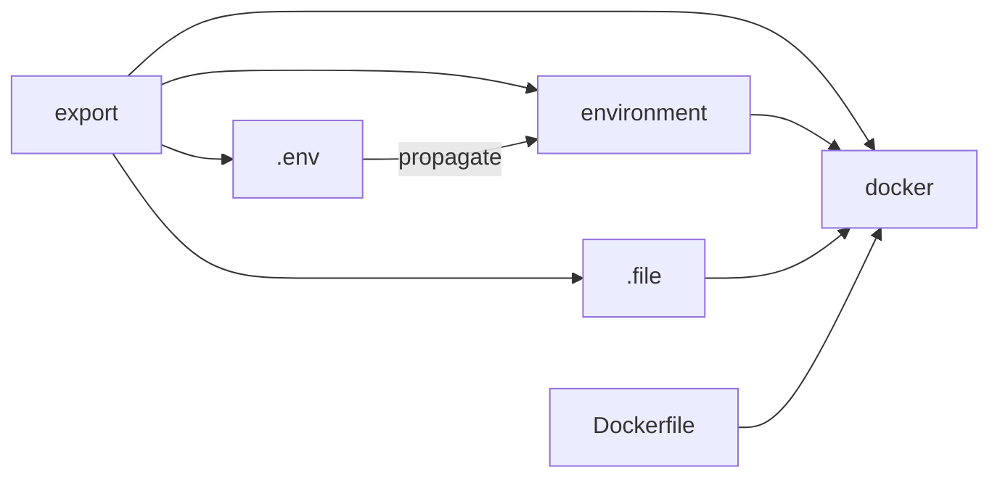
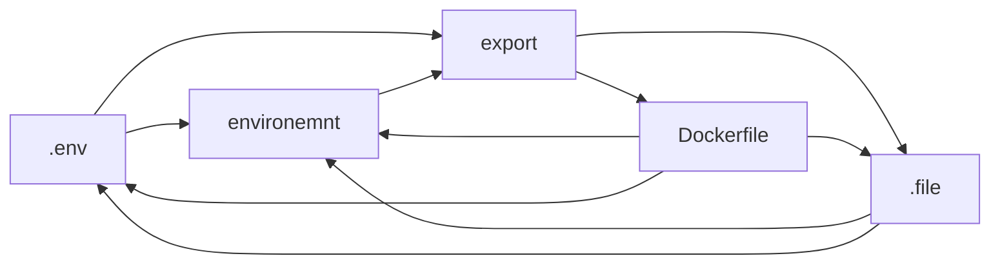
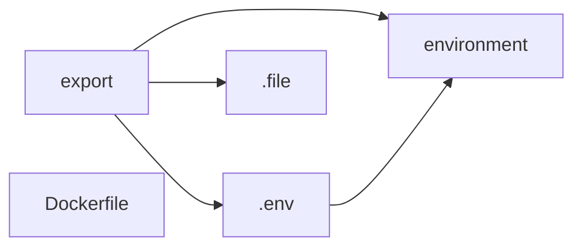
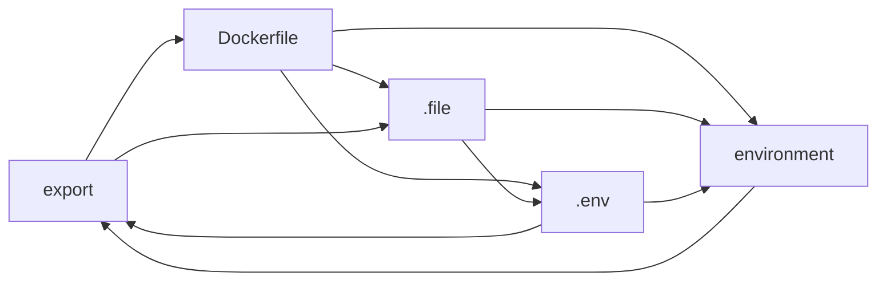

## Visibility

```mermaid
flowchart LR

%%subgraph cmd
  export
%%  subgraph compose
    .env
    environment
    .file
    
%%    subgraph dockerfile
      Dockerfile
      docker
%%    end
%%  end
%%end

export & environment & .file & Dockerfile --> docker
export --> .env & environment & .file
.env --propagate--> environment

```

## Override

```mermaid
flowchart LR
.env & .file & Dockerfile --> environemnt
.env & environemnt --> export
export & Dockerfile --> .file 
export --> Dockerfile
.file & Dockerfile --> .env
```

## Generated

### Visibility

```mermaid
flowchart LR
EXPORT["export"]
ROOT[".env"]
INLINE["environment"]
INTERNAL_1[".file"]
DOCKER["Dockerfile"]

EXPORT --> INLINE
ROOT --> INLINE
EXPORT --> INTERNAL_1
EXPORT --> ROOT
```

### Override

```mermaid
flowchart LR
EXPORT["export"]
ROOT[".env"]
INLINE["environment"]
INTERNAL_1[".file"]
DOCKER["Dockerfile"]

EXPORT --> DOCKER
DOCKER --> INLINE
DOCKER --> INTERNAL_1
DOCKER --> ROOT
INLINE --> EXPORT
EXPORT --> INTERNAL_1
ROOT --> EXPORT
INTERNAL_1 --> INLINE
ROOT --> INLINE
INTERNAL_1 --> ROOT
```

## Resource

https://docs.google.com/spreadsheets/d/19K0_WyX0GVQz8yC1I-DRghqdMYswBS6wzD5rDMaCeHM/edit#gid=867898497