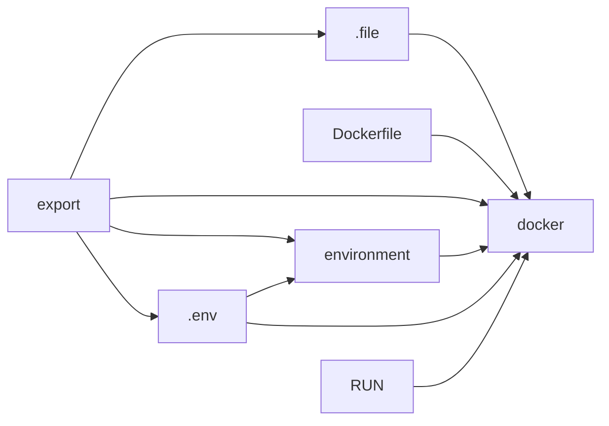
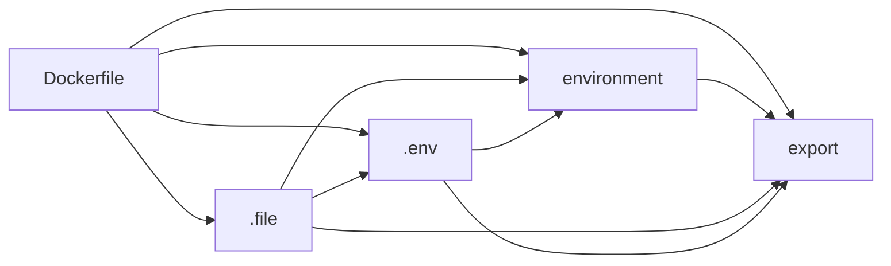

## Generated

https://docs.google.com/spreadsheets/d/19K0_WyX0GVQz8yC1I-DRghqdMYswBS6wzD5rDMaCeHM/edit#gid=867898497

### Visibility

```mermaid
flowchart LR

EXPORT["export"]
ROOT[".env"]
INLINE["environment"]
INTERNAL_1[".file"]
DOCKER["Dockerfile"]
INTERNAL_1 --> docker

DOCKER --> docker
EXPORT --> docker
INLINE --> docker
ROOT --> docker
RUN --> docker
EXPORT --> INLINE
ROOT --> INLINE
EXPORT --> INTERNAL_1
EXPORT --> ROOT
```

### Override

```mermaid
flowchart LR
EXPORT["export"]
ROOT[".env"]
INLINE["environment"]
INTERNAL_1[".file"]
DOCKER["Dockerfile"]

DOCKER --> EXPORT
DOCKER --> INLINE
DOCKER --> INTERNAL_1
DOCKER --> ROOT
INLINE --> EXPORT
INTERNAL_1 --> EXPORT
ROOT --> EXPORT
INTERNAL_1 --> INLINE
ROOT --> INLINE
INTERNAL_1 --> ROOT
```
